# WARNING: This repository is no longer maintained

> This repository will not be updated. The repository will be kept available in read-only mode.

## Integrate Instana with a Microservice Application on OpenShift

https://developer.ibm.com/patterns/integrating-instana-with-microservice-app-on-openshift/

In this code pattern, we will integrate [Instana](https://www.instana.com/) with a polyglot microservice travel application on OpenShift. Instana is a fully automated Enterprise Observability solution, with infrastructure monitoring and Application Performance Management (APM), designed specifically for the challenges of managing microservice and cloud-native applications. We will generate traffic to the application using [Puppeteer](https://developers.google.com/web/tools/puppeteer/) and analyze the traffic on the Instana dashboard. The travel application used in this code pattern is a part of the [Bee Travels](https://bee-travels.github.io/) project that focuses on some of the first version services of the application. The services included in this code pattern are:
* Destination v1 (Node.js)
* Car Rental v1 (Node.js)
* Hotel v1 (Python)
* Currency Exchange (Node.js)
* UI (Node.js/React)

# Architecture


1. The Puppeteer script generates traffic to the Bee Travels application running in the OpenShift cluster.
2. The Instana code in each service of the Bee Travels application sends data about each respective service to the Instana Agent in the OpenShift cluster (one Instana Agent per cluster node).
3. The Instana Agent sends that data to your account on Instana where you can analyze/monitor the Bee Travels microservices through the Instana dashboard.

# Steps

1. [Prerequisites](#1-prerequisites)
2. [Clone the repo](#2-clone-the-repo)
3. [Integrate Instana](#3-integrate-instana)
4. [Deploy to OpenShift](#4-deploy-to-openshift)
5. [Generate Traffic and Analyze with Instana](#5-generate-traffic-and-analyze-with-instana)

## 1. Prerequisites

* [IBM Cloud account](https://cloud.ibm.com/registration)
* [OpenShift CLI (oc)](https://cloud.ibm.com/docs/openshift?topic=openshift-openshift-cli#cli_oc)
* [Docker](https://www.docker.com/products/docker-desktop)
* [NodeJS](https://nodejs.org/en/download/)
* [NPM](https://www.npmjs.com/get-npm)
* [Yarn](https://classic.yarnpkg.com/en/docs/install)
* [Pupeteer](https://developers.google.com/web/tools/puppeteer/get-started)
* [Access to Instana](https://www.instana.com/trial/): If you do not have Instana server setup already, you can use `free trial` of Instana to execute this code pattern.

## 2. Clone the repo

Clone the repository using the following command.

```
git clone https://github.com/IBM/instana-openshift.git
```

You need to make some changes in the cloned repo and run the script as explained in further steps.

## 3. Integrate Instana

Once you have access to Instana, open up the Instana dashboard. Press `Add Website` and enter a name for your website ex. `Bee Travels`

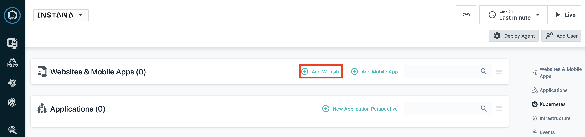

Copy the generated script and insert it into the `<head>` tag of [/src/services/ui/frontend/public/index.html](src/services/ui/frontend/public/index.html). This integrates Instana into the UI front end of the application. This will now allow you to analzye page loads, traffic, and more to the front end of the application.

Instana is already integrated into the services. To learn how to integrate Instana with your own services, documentation is provided for integrating Instana into [Node.js](https://www.instana.com/docs/ecosystem/node-js/configuration/) and [Python](https://www.instana.com/docs/ecosystem/python/configuration/) applications, as well as [many other technologies](https://www.instana.com/docs/ecosystem/). Having Instana in backend services allows for distributed traces, telemetry and other information about calls made to a service to be sent to Instana. In addition, you can analyze individual trace calls to show how your services are communicating with one another. You can view how Instana is integrated in each Bee Travels service here by going to the following:

**Destination Service**
* Source code: [src/services/destination-v1/src/app.js](src/services/destination-v1/src/app.js) (lines 14-17)
* Deployment yaml: [config/destination-v1-deploy.yaml](config/destination-v1-deploy.yaml) (lines 53-64)

**Car Rental Service**
* Source code: [src/services/car-rental-v1/src/app.js](src/services/car-rental-v1/src/app.js) (lines 15-18)
* Deployment yaml: [config/carrental-v1-deploy.yaml](config/carrental-v1-deploy.yaml) (lines 53-64)

**Hotel Service**
* Source code: [src/services/hotel-v1-python/app/\__init__.py](src/services/hotel-v1-python/app/__init__.py) (lines 11-12, 28)
* Deployment yaml: [config/hotel-v1-python-deploy.yaml](config/hotel-v1-python-deploy.yaml) (lines 53-64)

**Currency Exchange Service**
* Source code: [src/services/currency-exchange/src/app.js](src/services/currency-exchange/src/app.js) (lines 14-17)
* Deployment yaml: [config/currencyexchange-deploy.yaml](config/currencyexchange-deploy.yaml) (lines 51-62)

Now that Instana has been incorporated into the code, we are now ready to get the credentials for deploying an Instana Agent. To do this, from the Instana dashboard press `Deploy Agent`

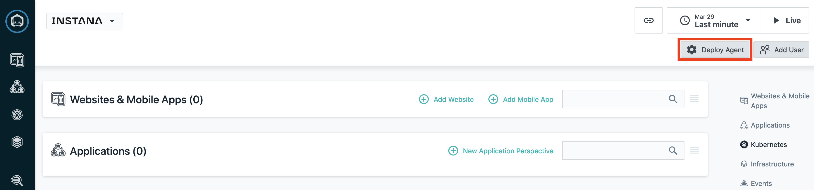

Next, select `OpenShift` as the platform and `Operator` as the technology and copy the `Instana Service Endpoint`, `Instana Service port` and `Instana Application Key`. These will be needed later when deploying the Instana Agent into your OpenShift cluster.

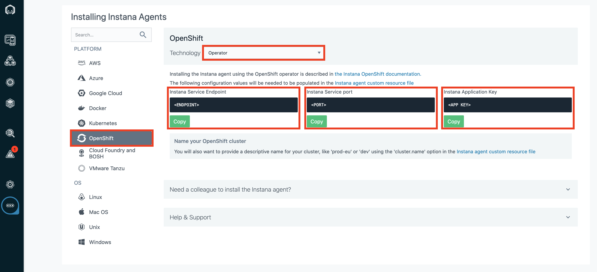

## 4. Deploy to OpenShift

1. Provision an [OpenShift Cluster](https://cloud.ibm.com/kubernetes/catalog/create?platformType=openshift).
> NOTE: This step can take about 30 minutes

2. Open the OpenShift console and copy/paste your login command (`oc login...`) to a terminal window.

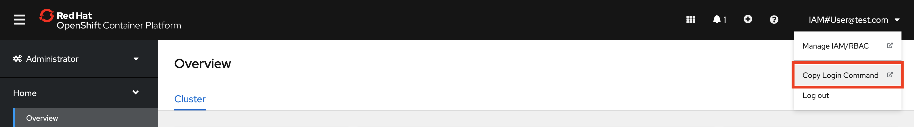

3. From the terminal window, run the `build-and-deploy.sh` script to build the Bee Travels application and deploy it to your OpenShift cluster.
> NOTE: This step can take a few minutes

```
cd instana-openshift
./build-and-deploy.sh -d <DOCKERHUB_USERNAME>
```

Once the script completes, you can verify the application services are running on your OpenShift cluster by going to `Workloads` -> `Pods` in your OpenShift console. Also, verify you are in the newly created `bee-travels` project. It should look like the following:

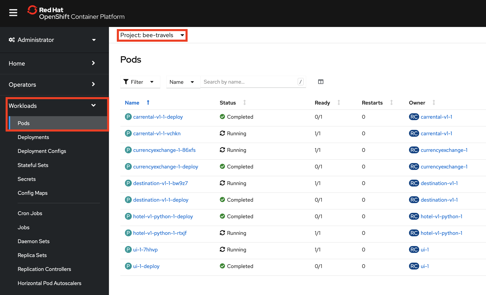

4. Now that the application services are deployed to your OpenShift cluster, it is time to expose the UI using a route. From the OpenShift console, go to `Networking` -> `Routes` and press the `Create Route` button.

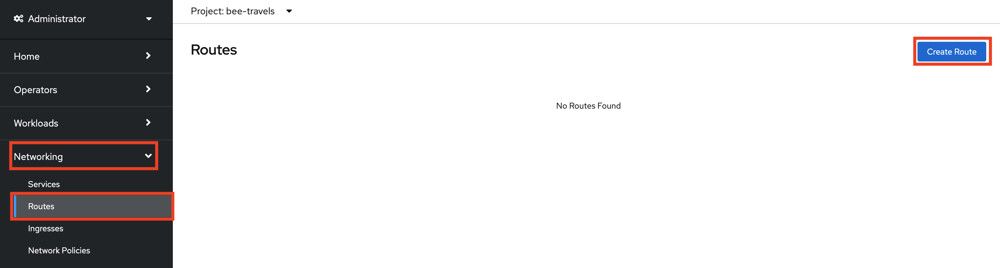

Next, fill out the route fields exactly like the following screenshot and then create the route.

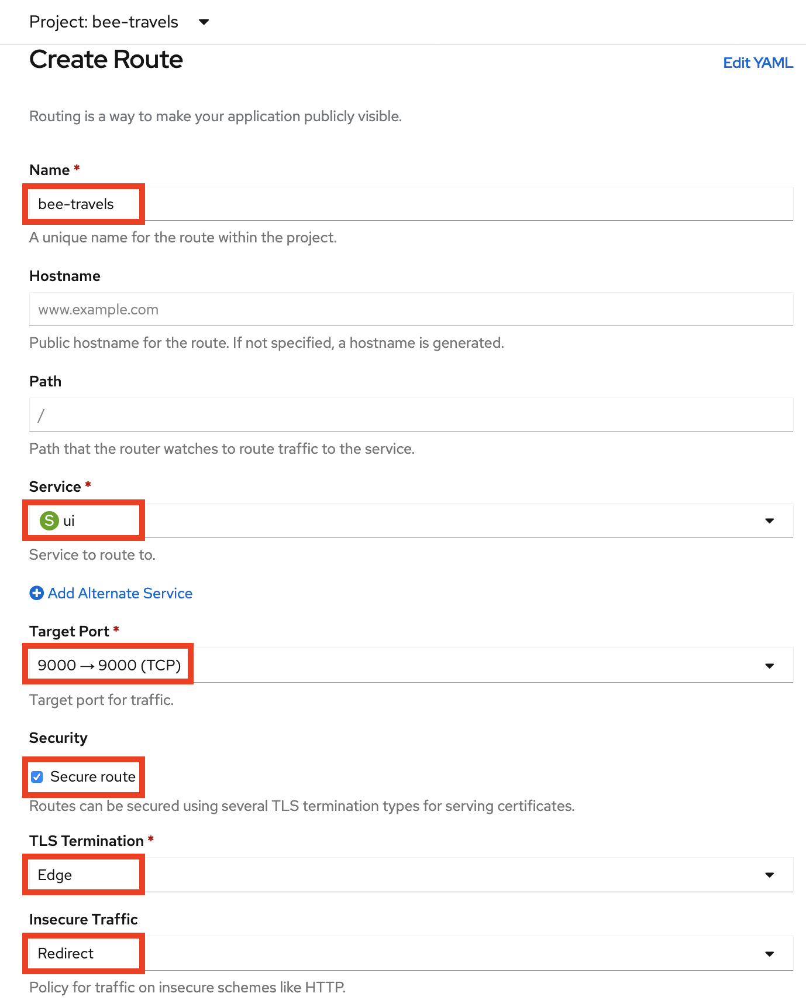

Keep note of the newly created route's location/url as this will be needed for later.

5. The final step with the OpenShift cluster is to install the Instana Agent Operator from OperatorHub. First, you need to create a project for the Instana Agent and configure it's permissions. From your terminal window run the following commands:

```
oc new-project instana-agent
oc adm policy add-scc-to-user privileged -z instana-agent
```

Next, go to `Operators` -> `OperatorHub` in your OpenShift cluster and search for the Instana Agent Operator. Verfiy that you are in the newly created `instana-agent` project. Install the operator.

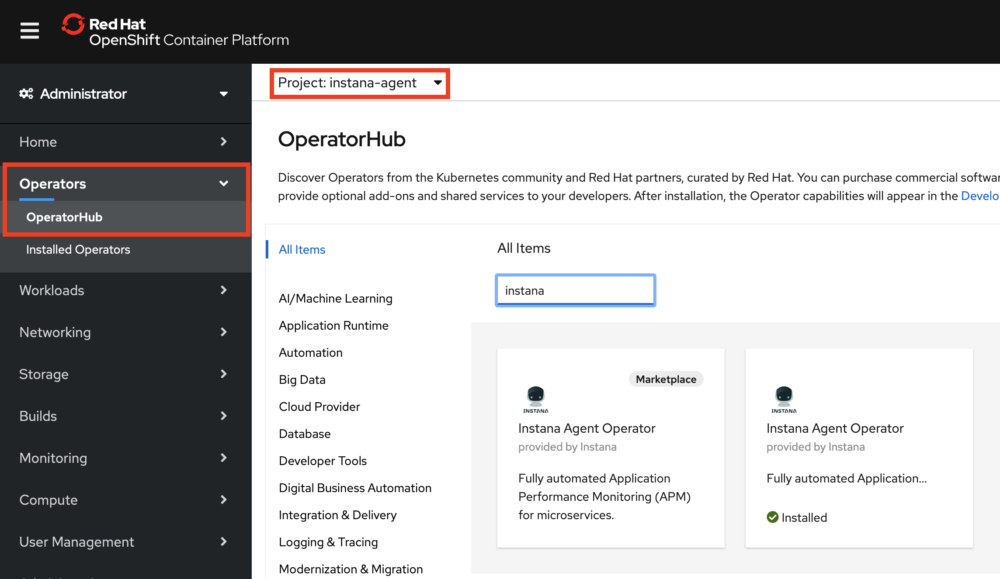

Once the operator is installed, create an instance of an Instana Agent.

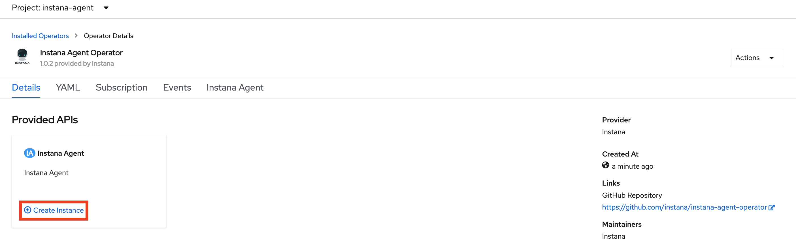

Make sure to configure via `YAML view` and edit the YAML to look like the following screenshot. This is where we will incorporate the Instana credentials that were copied from the previous step. `<APP KEY>` refers to the `Instana Application Key`, `<ENDPOINT>` refers to the `Instana Service Endpoint`, and `<PORT>` refers to the `Instana Service port`. Once the YAML file is properly configured, create the instance of the Instana Agent.

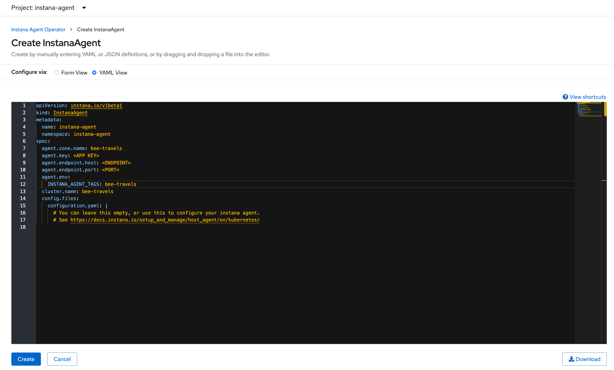

## 5. Generate Traffic and Analyze with Instana

At this point, you should start to notice your Instana dashboard populating with information from your OpenShift cluster. It is now time to start generating some traffic to the Bee Travels application that is running in your OpenShift cluster. To generate traffic, we will be using a script that uses [Puppeteer](https://developers.google.com/web/tools/puppeteer/). From your terminal window, run the following to generate traffic:

```
cd traffic
npm install
node traffic.js <NUM_CALLS> <ROUTE>
```

`NUM_CALLS` - refers to how many calls will be made to the Bee Travels application. Each call will make 2 requests to the application. One will be for searching hotels for a random city and the other will be for searching car rentals for the same random city.

`ROUTE` - refers to the created route's location/url from OpenShift. Make sure there is no trailing `/`

Once the traffic script is finished running, go to your Instana dashboard and click on your Bee Travels website to view the traffic. If you are not seeing any traffic, update your viewing time range in the top right corner. Once you are able to view the traffic, you can press `Analyze Page Loads` to view the individual calls made to the front end UI.

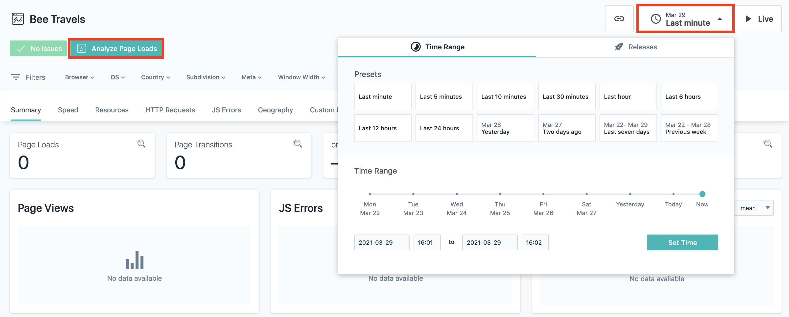

From here, you can scroll down to view all individual calls that were made to the front end UI. Select on one of the calls and click on the path to analyze the individual call.

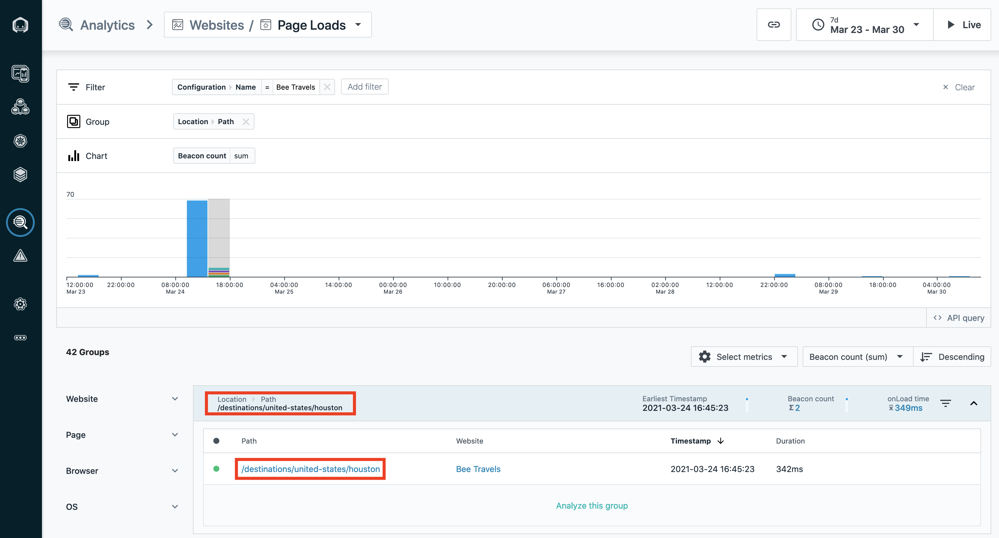

Once you are viewing the individual call, scroll down and view the XHR activity. You will notice that some of the requests have a `View Backend Trace` button. Clicking on the button will show a request trace for a backend Bee Travels service that is being called by an API call from the front end UI.

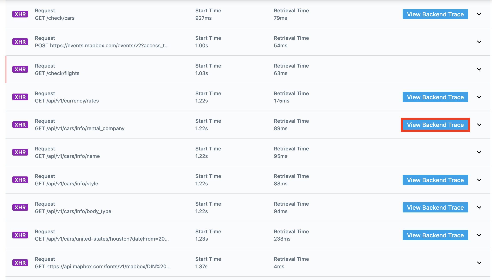

While viewing the trace, you can click on the service from the `Service Endpoint List` to analyze that backend service on Instana.

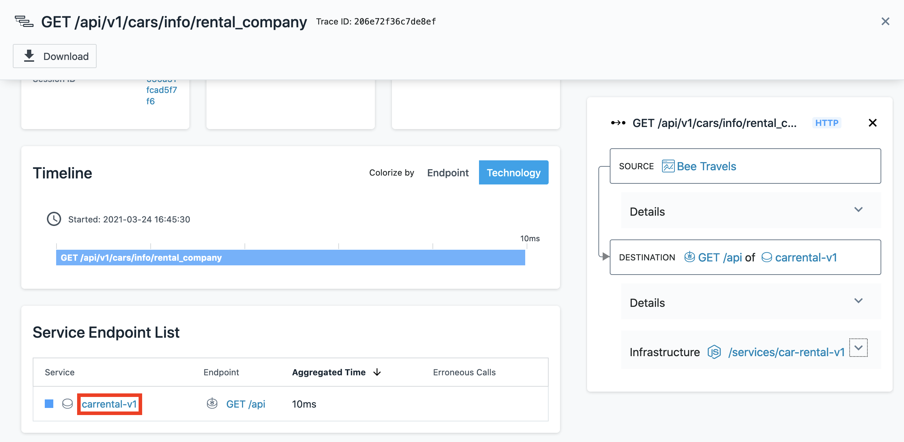

This is as far as this code pattern goes with analyzing Bee Travels on Instana but feel free to check out more of what Instana offers in the Instana dashboard.

# License

This code pattern is licensed under the Apache License, Version 2. Separate third-party code objects invoked within this code pattern are licensed by their respective providers pursuant to their own separate licenses. Contributions are subject to the [Developer Certificate of Origin, Version 1.1](https://developercertificate.org/) and the [Apache License, Version 2](https://www.apache.org/licenses/LICENSE-2.0.txt).

[Apache License FAQ](https://www.apache.org/foundation/license-faq.html#WhatDoesItMEAN)
